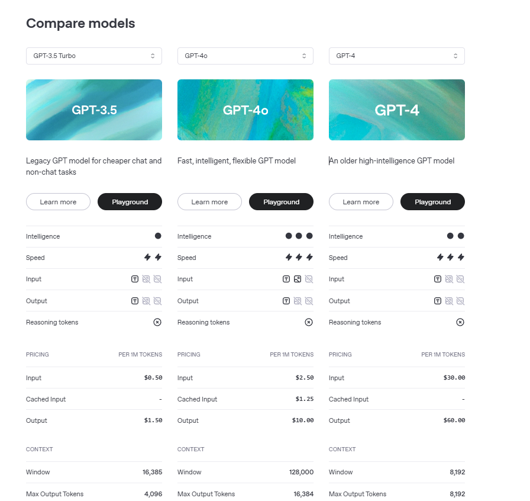

# Chat GPT API 사용법

*시작하기 전에*

- *Python에서 OpenAI 공식 라이브러리를 제공*
- *이전 프로젝트에서도 사용했던 FastAPI는 Python 전용 웹 프레임워크*

*위와 같은 이유로 이번 프로젝트에서도 FastAPI를 사용하게 된다면 Chat GPT API를 사용하기 위한 언어는 Python으로 결정하는것이 좋아보인다.*

---

[바로 시작하는 ChatGPT](https://wikidocs.net/book/12439)

## 프롬프트 작성하는 법

프롬프트는 GPT에게 원하는 결과를 얻기 위한 지침이나 가이드라고 할수 있다. 

대부분 GPT를 사용하면서 대화가 길게 이어지다보면 GPT가 이전의 대화에 맞춰 최적화 된 답변을 하는 것을 경험해본적이 있을것이다. (이전 회의에서 민석님이 GPT가 프로젝트 이해할 수 있게 대화하던 상황도 같은 것임)

실제 프롬프트 작성도 이와 비슷한 흐름으로 진행된다. 
사전에 미리 대화내역을 작성하여 GPT에게 더 정확한 대답을 혹은 특정한 대답을 이끌어내도록하는 것이다. 

아래는 대화 내역(프롬프트)을 작성하는 2가지 방법이다.

### 멀티 턴 대화

사전에 여러번의 예시와 role을 설정해서 특정한 용도에서 사용할 수 있도록 프롬프트를 조작하는 방법

```c
def prompt(context, question):
    return openai.chat.completions.create(
        model="gpt-3.5-turbo",
        messages=[
            {"role": "assistant", "content": "안녕하세요 저는 도서관리 시스템입니다. 책 내용을 알려주시면 해당 책에서 답변을 느리겠습니다."},
            {'role': 'user', 'content': f'내가 책 내용을 알려줄게 책 내용은 이렇게 이루어져 있어 Context: {context}'},
            {"role": "assistant", "content": "책 내용을 모두 확인하였습니다."},
            {"role": "user", "content": question}
        ],
    )
```

ex) context = "양자역학 책 내용", question = "양자역학에 대한 아인슈타인의 견해"

이런식으로 role을 지정해서 assistant와 user의 가상대화를 만들어두고 들어가야 할 내용들을 함수의 인자값으로 받으면, 찾고 싶은 내용과 질문을 함께 넣음으로써 해당 내용에서 내 질문에 대한 답변을 얻을 수 있다.

최신 정보 반영이 안되어있는 GPT한테, 최신의 자료를 넣어두고 그 내에서 답변을 받을 수 있는 방법 중 하나이다.

### 단일 턴 대화

한번만 호출하여 GPT에게 설정을 부여하는 방법

```c
CONTENT = """아래 문맥에 따라 질문에 대답해. 답변은 짧고 간결하게 작성해. 주어진 정보에서 대답할 수 없으면\"답변할 수 없음\"으로 응답해줘

정보 : 2023년 아시안게임 국가별 매달 수 정보야
순위, 국가, 금매달수, 은매달수, 동매달수, 합계
1, 중국,  201,    111,    71, 383
2,일본,   52, 67, 69, 188
3,대한민국, 42, 59, 89, 190
4,인도,   28, 38, 41, 107
5,우즈베키스탄,   22, 18, 31, 71
6, 대만,  19, 20, 28, 67
7, 이란,  13, 21, 20, 54

질문: 2023년 대한민국의 은매달수를 알려줘

답변:
"""

response = openai.chat.completions.create(
    model="gpt-3.5-turbo",
    messages=[
        {"role": "user", "content": CONTENT},
    ],
    temperature=0,
)
```

단일 턴 대화에서는 GPT의 한계를 우회적으로 극복이 가능하다.(멀티턴보다 항상 좋은 답변을 이끌어내는 것은 아님)

GPT의 한계

- 최신 정보 반영 불가
- 사실 검증 한계
- 문맥 유지 한계
- 윤리적 제약과 검열

즉 이 부분을 단일턴 대화에서 개발자가 직접 자료를 입력하여 극복 가능한 것이다.

---

[5. GPT 모델의 토큰 개념과 토큰 수 계산 방법](https://wikidocs.net/223125)

## 주의사항

GPT API를 사용시 토큰이 제한된다. 

토큰이란 GPT를 이용할때 사용되는 단어의 단위라고 이해하면 된다. 

보통 영문은 단어하나가 토큰 하나로, 국문은 글자 하나당 토큰 한개로 취급한다. 

최대 토큰수에 제한이 있기도 하지만 토큰을 많이 사용할 수록 비용이 증가하기 때문에 프롬프트 작성시 토큰을 효율적으로 정리하는 작업이 필요하다.

[OpenAI Platform](https://platform.openai.com/docs/models/compare)



위 사진에서 Context 항목을 보자. 

각 모델별 토큰 제한이 다름을 알수 있다. (GPT-3.5 : 16,385 / GPT-4o : 128,000)

중요한 점은 프롬프트 내용도 토큰이지만 이후 사용자가 입력하는 입력값과 GPT 모델이 답하는 출력값도 토큰에 포함되는 것이다. 

즉, 한번에 이어지는 모든 대화가 토크 제한 내에서 이루어져야한다는 것이다.
(우리 프로젝트에서 **프롬프트내용 + 계약서 출력 내용** 을 합친 토큰이 제한 토큰을 넘지 않아야한다.)

[https://platform.openai.com/tokenizer](https://platform.openai.com/tokenizer)

위 사이트에서 작성한 프롬프트가 몇 토큰인지 계산할 수 있다. 
프롬프트 작성을 하면서 수시로 확인해 보면 좋을 듯 하다.

### 프롬프트 테스트시 토큰 걱정 없이 테스트 하는 방법

1. [https://platform.openai.com/playground/prompts?models=gpt-4o](https://platform.openai.com/playground/prompts?models=gpt-4o)
2. [https://chatgpt.com/](https://chatgpt.com/) 
API 없이 웹 GPT를 이용하는 것도 프롬프트 테스트로 사용가능하다

### API 테스트시 고려해야하는 점

토큰에 따라 발생하는 비용이 모델별로 다르다. 
하지만 그렇다고 비용이 적은 모델은 성능이 떨어져 오히려 여러번 테스트를 하게 될 수도 있다.