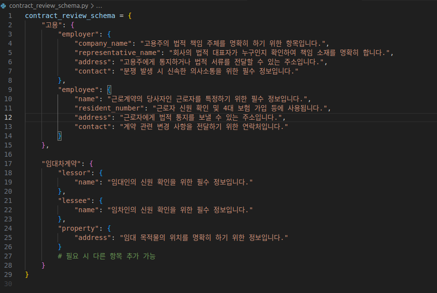
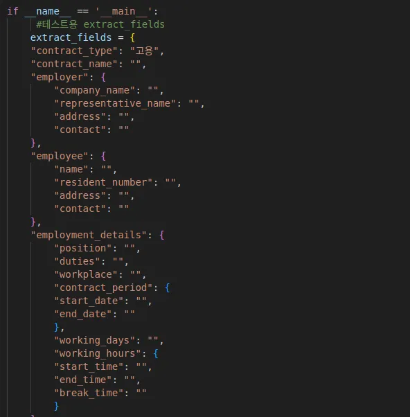

# 법률자문 추가 로직 구현(5/23 수정)

    
  목표
  
  - 각 계약 유형별 중요 키워드가 공란일 경우 법률 자문 추가
  
  전체 코드는 github에 올려놓았으니 필요하신 분은 github를 봐주시면 감사하겠습니다.
  
  ---
  
  ## 함수 코드
  
  ```python
  def annotate_contract_text(    
    contract_type: str,    
    extract_fields: dict,    
    gpt_caller: Callable[[list[dict]], str]  # dict들의 리스트를 인자로 받아 문자열을 리턴하는 함수
  ) -> str:   
        
    schema = contract_review_schema.get(contract_type, {})
    
    # selected_keys 생성    
    selected_keys = []    
    def extract_keys(prefix, d):        
      for k, v in d.items():            
        full_key = f"{prefix}.{k}" if prefix else k            
        if isinstance(v, dict):                
          extract_keys(full_key, v)            
        else:                
          selected_keys.append(full_key)    
    extract_keys("", schema)
    
    # keyword_descriptions 생성    
    def flatten_descriptions(prefix, d):        
      flat = {}        
      for k, v in d.items():            
        full_key = f"{prefix}.{k}" if prefix else k            
        if isinstance(v, dict):                
          flat.update(flatten_descriptions(full_key, v))            
        else:                
          flat[full_key] = v        
      return flat
      
    keyword_descriptions = flatten_descriptions("", schema)
    keyword_review_info = "\n".join(        
      f"- `{key}`: {desc}" for key, desc in keyword_descriptions.items() if key in selected_keys    
    )
            
    filtered_fields = {}    
    for key_path in selected_keys:        
      parts = key_path.split(".")        
      sub_data = extract_fields        
      sub_result = filtered_fields
      
      for i, part in enumerate(parts):            
        if isinstance(sub_data, dict) and part in sub_data:                
          if i == len(parts) - 1:                    
            # 마지막 키라면 값 할당                    
            sub_result[part] = sub_data[part]                
          else:                    
            if part not in sub_result:                        
              sub_result[part] = {}                    
            sub_result = sub_result[part]                    
            sub_data = sub_data[part]           
        else:                
          break  # 키가 없으면 무시
      
            
      
    prompt = f"""    """
    
    messages = [        
      {            
        "role": "system",             
        "content": (                
          "당신은 법률 문서를 검토하는 전문가입니다. "            
          )       
      },        
      {            
        "role": "user",             
        "content": prompt        
      }   
    ]        
    
    response = gpt_caller(messages)        
    result = response.choices[0].message.content.strip()    
    try:       
      return json.loads(result)    
    except json.JSONDecodeError:        
      raise ValueError("GPT 응답에서 JSON 파싱 실패:\n" + result)
  
  ```
  
  ## 프롬프트
  
  ```python
  prompt = f"""    
      다음은 작성된 계약서에서 추출된 중요 키워드의 JSON 형식입니다. 
      
      각 항목의 값이 공란("")일 경우에만 법률적 관점에서 검토하고, 그에 따른 간단한 문제 설명을 작성해 주세요.        
      값이 비어있지 않은 항목은 응답에서 빈 문자열("")로 남겨두고, 절대 코멘트하지 마세요.
      
      ❗주의사항:        
      - 반드시 JSON 형식으로 출력하세요.        
      - 모든 키(key)와 문자열 값(value)은 **이중 따옴표(")** 를 사용하세요.        
      - **단일 따옴표(')** 는 절대 사용하지 마세요.        
      - 응답에는 JSON 외의 설명, 해석, 안내 문구를 포함하지 마세요.        
      - JSON 구조는 입력과 동일하게 유지해 주세요.
      
      [검토 대상 키워드]        
      {json.dumps(filtered_fields, indent=2, ensure_ascii=False)}
      
      [각 키워드의 법적 의미 및 목적]        
      {keyword_review_info}
      
      [지시사항]        
      - 공란("")인 항목에 대해서만, 해당 키워드의 법적 의미를 참고해 발생할 수 있는 문제를 간단히 작성해 주세요.        
      - 비어있지 않은 값은 빈 문자열("")로 출력하고, 관련 코멘트는 하지 마세요.        
  """
      
  messages = [    
    {        
      "role": "system",         
      "content": (            
          "당신은 법률 문서를 검토하는 전문가입니다. "        
          )    
    },    
    {        
        "role": "user",         
        "content": prompt    
    }
  ]
  ```
  
  ---
  
  ## 설명
  
  사전 단계
  
  - 계약 유형 추출 & 계약서 키워드 추출이 완료된 상태
  - 계약 유형에 따른 중요 키워드 및 중요키워드가 법적으로 무슨 의미가 있는 지 선별 되어있어야함
      - contract_review_schema.py 로 관리
          
          
          
  
  입력값
  
  - 계약 유형
  - 추출된 계약서 키워드 json형태의 파일
  
  동작 과정
  
  1. 입력값의 계약 유형에 따른 중요 키워드 및 중요키워드가 법적의미를 contract_review_schema.py에서 가져옴
      
      ```python
      # contract_review_schema 파일에서 입력받은 계약유형에 따른 schema 가져옴
      schema = contract_review_schema.get(contract_type, {})
        
      # selected_keys 생성    
      selected_keys = []    
      def extract_keys(prefix, d):  
        # selected_keys에 schema에서 키워드만 담는 코드
      
          
      def flatten_descriptions(prefix, d):  
        # 중첩 dict 구조를 단일 dict 구조로 평탄화 하는 코드
        # 중첩된 dict 구조는 selected_key와 맞지 않고 프롬프트 작성에 맞지 않아서 이런 과정이 필요함      
        
      # 평탄화된 구조에서 keyword_descriptions 생성 
      keyword_descriptions = flatten_descriptions("", schema)
      
      # 프롬프트에 작성되는 형태로 바꿔줌
      # keyword_descriptions는 아직 json 형태인데 프롬프트에서는 노션처럼 markdown 형태가 받아들이기 쉬워서 이런 작업 거처줘야함.
      keyword_review_info = "\n".join(        
          f"- `{key}`: {desc}" for key, desc in keyword_descriptions.items() if key in selected_keys    
      )
      ```
      
  2. 입력값으로 받은 생성된 계약서 키워드에서 중요 키워드만 추출
  즉 전체 key : value 에서  중요 키워드에 대한 key : value만 추출
      
      ```python
      filtered_fields = {}    
      for key_path in selected_keys:        
        parts = key_path.split(".")        
        sub_data = extract_fields        
        sub_result = filtered_fields
        
        for i, part in enumerate(parts):            
          if isinstance(sub_data, dict) and part in sub_data:                
            if i == len(parts) - 1:                    
              # 마지막 키라면 값 할당                    
              sub_result[part] = sub_data[part]                
            else:                    
              if part not in sub_result:                        
                sub_result[part] = {}                    
              sub_result = sub_result[part]                    
              sub_data = sub_data[part]           
          else:                
            break  # 키가 없으면 무시
        
      ```
      
  3. 프롬프트로 각 계약 유형별 법적 의미를 중심으로 검토를 해주고 json 형식으로 반환하도록 지시
  4. gpt 가 반환하는 값이 json 형태인지 확인 → 이 코드는 서영님 코드에서 가져왔습니다.
  
  ---
  
  ## 동작 테스트
  
  입력값은 테스트 용으로 하드코딩해서 입력하였습니다.(gpt 호출이 응답 시간이 좀 걸려서 최소화 함)
  
  ### 입력값 - 모두 빈칸일 경우
  
  
  
  
  
  ### 결과
  
  
  
  ```python
  {
    "employer": {
      "company_name": "회사 이름이 공란일 경우, 고용주의 법적 책임 주체를 명확히 할 수 없어 법적 분쟁 시 문제가 발생할 수 있습니다.",
      "representative_name": "대표자 이름이 공란일 경우, 회사의 법적 대표자를 확인할 수 없어 책임 소재를 명확히 하는데 어려움이 있을 수 있습니다.",
      "address": "주소가 공란일 경우, 법적 서류를 전달하거나 통지하는데 어려움이 있을 수 있습니다.",
      "contact": "연락처가 공란일 경우, 분쟁 발생 시 신속한 의사소통이 어려울 수 있습니다."
    },
    "employee": {
      "name": "이름이 공란일 경우, 근로계약의 당사자를 특정하기 어려워 법적 문제가 발생할 수 있습니다.",
      "resident_number": "주민등록번호가 공란일 경우, 근로자의 신원 확인 및 4대 보험 가입 등에 문제가 발생할 수 있습니다.",
      "address": "주소가 공란일 경우, 법적 통지를 보낼 수 없어 문제가 발생할 수 있습니다.",
      "contact": "연락처가 공란일 경우, 계약 관련 변경 사항을 전달하는데 어려움이 있을 수 있습니다."
    }
  }
  ```
  
  중요 키워드에 대해서만 공란일 경우 발생할 문제에 대해서 자문해줌
  
  ### 입력값 - 일부만 빈칸일 경우
  
  
  
  ### 결과
  
  
  
  ```python
  {
    "employer": {
      "company_name": "",
      "representative_name": "회사의 법적 대표자 정보가 없어서 책임 소재를 명확히 할 수 없습니다.",
      "address": "",
      "contact": "분쟁 발생 시 신속한 의사소통이 어려울 수 있습니다."
    },
    "employee": {
      "name": "근로계약의 당사자인 근로자를 특정할 수 없습니다.",
      "resident_number": "근로자의 신원 확인 및 4대 보험 가입이 어려울 수 있습니다.",
      "address": "근로자에게 법적 통지를 보낼 수 없습니다.",
      "contact": ""
    }
  }
  ```
  
  채워진 키워드에 대해서는 value없이 답변함
  
  아직 테스트를 많이 거치지 않아서 답변에 일관성 있는지 아닌지는 확인이 필요함
  예) 키워드가 채워져있는데 gpt가 빈칸이 아닌 value를 채운채로 답변함
  

# 수정(개선) 사항

- [프롬프트 개선](https://www.notion.so/1fc9c110be4180b69462d19cfdd2d4d4?pvs=21)
- [스키마 개선](https://www.notion.so/1fc9c110be4180b59271e48f32e69598?pvs=21)

---

## 프롬프트 개선

- 제약사항 추가하여 일정한 형식을 출력하도록 개선
- CoT 기법을 적용하여 더욱 일관성 있고 정확한 답변을 하도록 개선
- 코드로 삽입되는 변수는 기존과 변경점 없음

```python
    prompt = f"""
        다음은 작성된 계약서에서 추출된 중요 키워드의 JSON 형식입니다.

        ## [검토 대상 키워드]
        {json.dumps(filtered_fields, indent=2, ensure_ascii=False)}

        아래 지시사항에 따라 단계적 사고하고, 최종 결과는 반드시 위 JSON 구조와 동일한 형식으로 출력하세요.

        ---

        ## 1단계: 각 항목의 값을 확인합니다.
        - 항목의 값이 공란("")인지 확인합니다.

        ## 2단계: 공란("")인 경우, 다음의 [각 키워드별 공란 시 문제점]을 바탕으로 해당 항목이 빠졌을 때 발생할 수 있는 법적 문제를 설명합니다.
        - 반드시 다음과 같은 형식으로 작성하세요:  
	        **"공란일 경우 ~ 수 있습니다."** (예: 공란일 경우 계약 효력이 부정될 수 있다.)
        - 반드시 **"공란일 경우"**로 시작하는 문장만 작성합니다.

        ## [각 키워드별 공란 시 문제점]
        {keyword_review_info}

        ## 3단계: 공란이 아닌 경우, 절대 어떤 판단도 하지 않고 해당 항목은 빈 문자열("")로 출력합니다.
        - 값이 있는 항목에 대해 절대 코멘트를 작성하지 않습니다.

        ## 4단계: 아래 조건에 따라 최종 JSON을 출력합니다.
        - 출력 결과는 반드시 위에 정의된 JSON 구조(계층, 필드명, 형식 포함)를 그대로 따라야 합니다.
        - 정의된 JSON 구조 이외의 dict 형태나 중첩 구조는 절대 허용하지 않습니다.
        - 반드시 JSON 형식으로만 출력하세요.
        - 모든 key와 value는 **이중 따옴표(")** 를 사용합니다.
        - 단일 따옴표(')는 절대 사용하지 않습니다.
        - **JSON 외의 설명, 해석, 단계 내용, 안내 문구는 절대 포함하지 않습니다.**
        - 오직 JSON 결과만 출력하세요.
        - JSON 이외의 텍스트가 포함되면 계약서로서 무효입니다.
        """
```

---

## 스키마 개선

[contract_review_schema.py](contract_review_schema.py)

- “증여, 매매, 교환, 소비대차, 사용대차, 임대차, 고용, 도급” 8가지에 대한 스키마 작성완료

계약서 생성 모듈에서 추출한 키워드중 중요 키워드를 따로 모아둔 스키마
→ 중요키워드가 빈칸일 경우 법률 자문 하기 위함.

여기서 중요 키워드를 조사와 개인적 생각을 통해 선정하였습니다. 키워드 선정에 있어 문제가 있는 것 같다면 슬랙 DM으로 알려주시면 감사하겠습니다!

키워드 선정

- 공통으로 제외된 키워드
    - **계약 당사자들에 대한 정보**
    - 특약사항
    - 계약 체결일
    - 서명란
    
    특약사항의 경우 애초에 정해진 키워드에서 벗어난 추가사항을 작성하는 칸으로 공란이어도 문제가 될것이 없습니다.
    
    계약 체결일, 서명란의 경우 빈칸일 경우라도 생성된 계약서를 출력한 후 실제로 서명하고 그 서명한 날짜를 직접 적는게 계약상 자연스러운 흐름이라고 생각해 제외하였습니다.
    
    계약 당사자들에 대한 정보의 경우 또한 위 계약 체결일, 서명을 하면서 계약을 전체적으로 살펴본뒤 자신의 개인정보를 작성하는 것이 자연스러운 흐름이라고 생각했습니다.
    
    계약 당사자들에 대한 정보의 경우 추가적으로 더 말하자면 이 정보가 공란일 경우 아무리 계약에 익숙하지 않은 사람이라도 계약상 문제가 있음을 인지할 정도로 상식적인 키워드 입니다.
    따라서 이런 키워드에도 일일이 자문을 추가한다면 계약서가 더러워질 것 같습니다.
    

나머지 계약 유형별 키워드 선정은 여기에 다 일일이 작성하기엔 너무 길어지므로
개인적으로 “이 키워드 왜 제외했나요”, “이건 왜 중요키워드인가요” 라고 슬랙 DM으로 의견주시면 제가 따로 답변 드리겠습니다