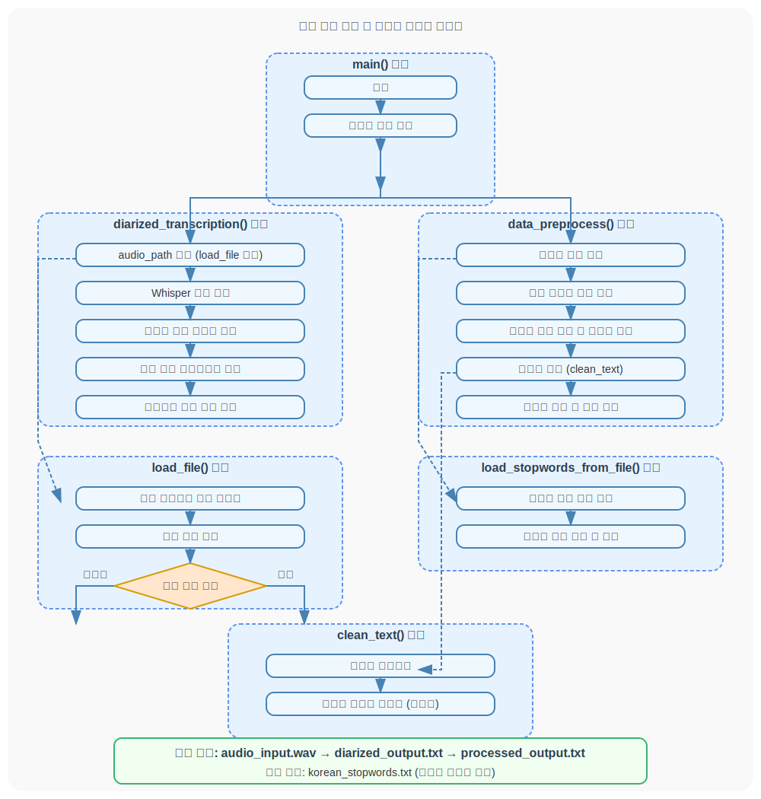

# 데이터 전처리 로직 구현

<aside>
💡 **전처리 단계:** 음성 추출 함수와 데이터 교정 함수를 구분하여 구현

- **음성 추출 및 화자 분리:** 음성 파일→ 텍스트 파일
    1. Whisper로 음성 파일을 텍스트 파일로 변환
    2. [pyannote.audio](http://pyannote.audio) 라이브러리를 활용하여 화자 분리
- **텍스트 전처리:** 텍스트 파일→텍스트 파일
    1. py-hanspell 라이브러리를 활용하여 맞춤법 및 띄어쓰기 교정
    2. 한국어 불용어 리스트와 nltk 라이브러리를 활용하여 불용어 제거
</aside>

---

<aside>
💡

입출력 파일 및 한국어 불용어 리스트(사전 작성)는 AI 디렉토리 내에 있다고 가정함

</aside>

- **파일 로드 기능** (`load_file` 함수)
    - 프로젝트 디렉토리 구조 내에서 파일 경로를 생성하고 유효성 검사
- **오디오 처리 파이프라인** (`diarized_transcription` 함수)
    - Whisper 모델을 사용한 음성-텍스트 변환
    - pyannote.audio를 사용한 화자 분리(2명 기준)
    - 각 발화에 화자 정보 추가 후 텍스트 파일로 저장
- **텍스트 전처리 파이프라인** (`data_preprocess` 함수)
    - 맞춤법 검사 (spell_checker 사용)
    - 텍스트 정제 (한글과 공백만 유지)
        - 대화 중 ‘아, / 음… / 그러고보니, ’ 등 문장부호가 붙은 불용어를 제대로 제거하지 못하는 문제를 해결하기 위해 한글과 공백만 유지하는 조건을 덧붙임
    - 불용어 제거
        - nltk 라이브러리는 한국어 불용어 리스트를 제공하지 않기에, 따로 작성해둔 불용어 TXT 파일과 대조해가며 필터링 함
    - 처리된 텍스트 저장
        - 백엔드 설계에 따라, 입력물(원본 녹음 파일, 1차 텍스트 파일)은 삭제함으로써 데이터 관리를 용이하게 함
- **보조 기능**
    - 불용어 로드 (`load_stopwords_from_file` 함수)
    - 텍스트 정제 (`clean_text` 함수)
    
    
    

### 코드(data_preprocess.py)

---

## 테스트 결과

- 입력 텍스트(고용 계약)
    
    ```cpp
    A: 음, 안녕하세요. 저희 회사에서 마케팅 담당자로 일해주실 수 있을까 해서요.
    B: 아, 그러시군요. 음... 관심은 있는데요. 그 업무 내용이랑 조건이 어떻게 되는지 좀 알 수 있을까요?
    A: 네, 그러니까 주 5일, 오전 9시부터 오후 6시까지 근무하시구요. 월급은 음... 세전으로 350만원 정도 생각하고 있어요. 주로 뭐 온라인 마케팅 전략 같은 거 수립하고 실행하는 일을 맡으실 거예요.
    B: 그렇군요. 혹시 직원 복지나 계약 기간은 어떻게 되나요?
    A: 아, 당연히 4대 보험은 다 되고요. 그리고 식대도 지원해 드리고, 연차는 15일 드립니다. 계약 기간은 일단 1년으로 하고요, 뭐 평가에 따라서 정규직으로 전환될 수도 있어요.
    B: 음... 알겠습니다. 그럼 그 조건으로 일하는 거 괜찮을 것 같아요. 다음 주 월요일부터는 출근 가능한데요.
    A: 아, 정말요? 그럼 좋죠. 다음 주 월요일 9시에 뵐게요. 감사합니다!
    ```
    

- **결과 텍스트**
    
    ```markdown
    회사에서 마케팅 담당자로 일해주실 수 있을까 해서요 관심은 있는데요 업무 내용이랑 조건이 되는지 알 수 있을까요 주 오전 시부터 오후 시까지 근무하시고요 월급은 세전으로 만 원 정도 생각하고 있어요 주로 뭐 온라인 마케팅 전략 같은 거 수립하고 실행하는 일을 맡으실 거예요 직원 복지나 계약 기간은 되나요 당연히 대 보험은 다 되고요 식대도 지원해 드리고 연차는 드립니다 계약 기간은 년으로 하고요 평가에 정규직으로 전환될 수도 있어요 알겠습니다 조건으로 일하는 거 괜찮을 같아요 주 월요일부터는 출근 가능한데요 정말요 좋죠 주 월요일 시에 뵐게요
    ```
    

## 추가 개선 방향

- [ ]  백엔드 구조에 맞게 로직 개선 필요
    - 불용어 리스트 위치 및 확장자 방식
    - 입출력 파일 위치에 따른 파라미터 수정
- [ ]  화자 분리 유지
    - 맞춤법 검사 및 불용어 제거 후에는 화자가 분리되어 있지 않은 형태로 저장되므로 이와 관련한 처리 필요
- [ ]  whisper의 한국어 인식 능력 부족
    - whisper 한국어 pine-tuning 필요
- [ ]  whisper 긴 입력값 처리
    - whipser는 25MB 미만 파일만 지원하므로 관련된 처리가 필요하다면 추가 개선해야 할듯함.